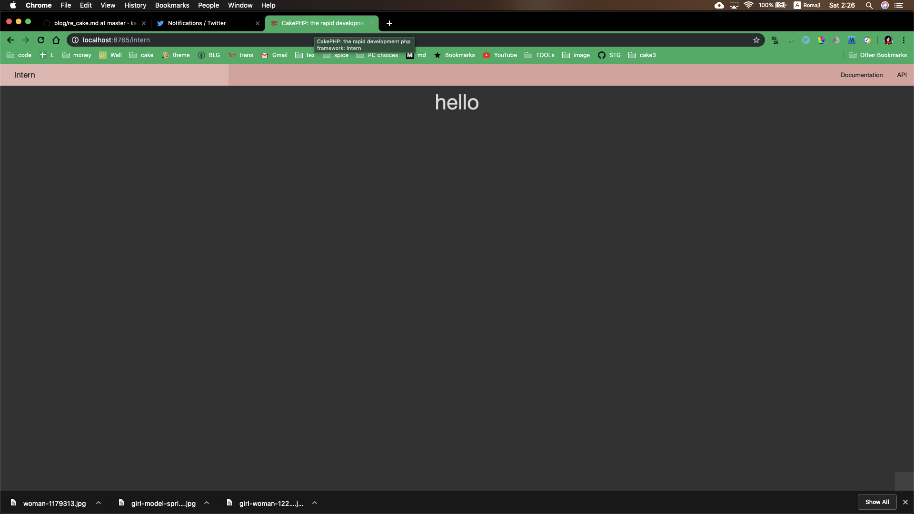
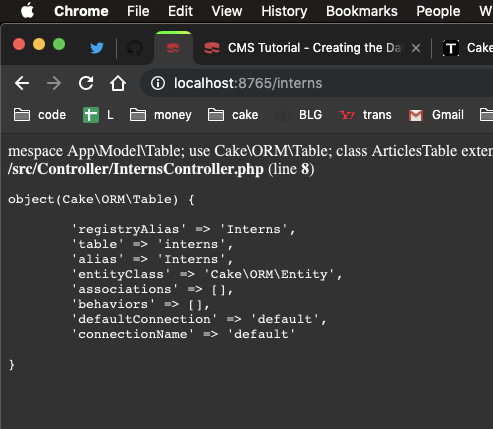

# re cake php
## why
find out the need of crud basic from ceress hackerson  
I made new rep `cake3` and this redo article.  
This is the usage from the MIN.  
## Start local host server
To start, and see in chrome, type:  
```
bin/cake server
```
You can see status in `http://localhost:8765/`  
## controller
To make a page, you need to make a proper controller.  
To make `localhost://8765/intern` page,  
You have to make `InternController.php`  
In `src/Controller/`  
Inside this, write:
```
<?php
namespace App\Controller;

use App\Controller\AppController;

class InternController extends AppController {
    public function index() {

    }
}
```
This refers to the views index.php file.  
Now You can access by browser `8765/intern`  
## View
If you want to write contents here, 
make view file. In this case,
```
src/Template/Intern/index.ctp
```
is needed. So make it. Then write this inside  
`<h1><center>hello</center></h1>`  
If it worked, you will see:  

You could access to `/intern` and 
view the view file here.  

## Access Database
In Intern/index.ctp, show data from db.
### Make Table
Create table by SQL, like:  
```
CREATE TABLE interns (
   id INT AUTO_INCREMENT PRIMARY KEY,
   email VARCHAR(255) NOT NULL,
);
```
### Insert Table
Insert some records to the table:  
```
INSERT INTO interns (email) VALUES
('cakephp@example.com');
```
### Model
This is `MVC` frame work. we made:  
VIEW, CONTROLLER, M left.  
This is MODEL. So let's make it.  
Write the table connection in Model here:  
```
Model/Table/
```
Make InternsTable.php  
Careful! Everything are pural.  
Inside here:  
```
namespace App\Model\Table;

use Cake\ORM\Table;

class InternsTable extends Table {
}
```
and check this. In InternsController, write:  
```
debug($this->Interns);
```
returns data structure:  


## todo
### top
Then make top page, and inserting calc, 
and deleting calc by db

