# re cake php
## why
find out the need of crud basic from ceress hackerson  
I made new rep `cake3` and this redo article.  
This is the usage from the MIN.  
MAKE KAEDE0902 GREAT CAKE USER!!!  
## Install Composer
`curl -s https://getcomposer.org/installer | php`
```
RYOs-MBP:cake3 kaede$ curl -s https://getcomposer.org/installer | php
All settings correct for using Composer
Downloading...

Composer (version 1.9.0) successfully installed to: /Users/kaede/code/cake3/composer.phar
Use it: php composer.phar
`php composer.phar create-project --prefer-dist cakephp/app interns`  
```
RYOs-MBP:cake3 kaede$ php composer.phar create-project --prefer-dist cakephp/app interns
Installing cakephp/app (3.8.0)
- Installing cakephp/app (3.8.0): Downloading (100%)
Created project in interns
Loading composer repositories with package information
Updating dependencies (including require-dev)
Package operations: 79 installs, 0 updates, 0 removals
- Installing cakephp/plugin-installer (1.1.1): Downloading (100%)
......
Writing lock file
Generating autoload files
> Cake\Composer\Installer\PluginInstaller::postAutoloadDump
> App\Console\Installer::postInstall
Created `config/app.php` file
Created `/Users/kaede/code/cake3/interns/tmp/cache/views` directory
```
Your directory will be like this:  
```
▾ interns/
    ▸ bin/
    ▸ config/
    ▸ logs/
    ▸ plugins/
    ▸ src/
    ▸ tests/
    ▸ tmp/
    ▸ vendor/
    ▸ webroot/
        composer.json
        composer.lock
        index.php
        phpunit.xml.dist
        README.md
composer.phar
README.md
refer.md
```
## Run server
To start, and see in chrome, type:  
```
bin/cake server
```
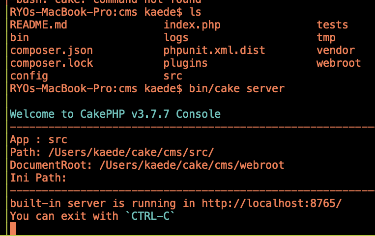  
You can see status in `http://localhost:8765/`  
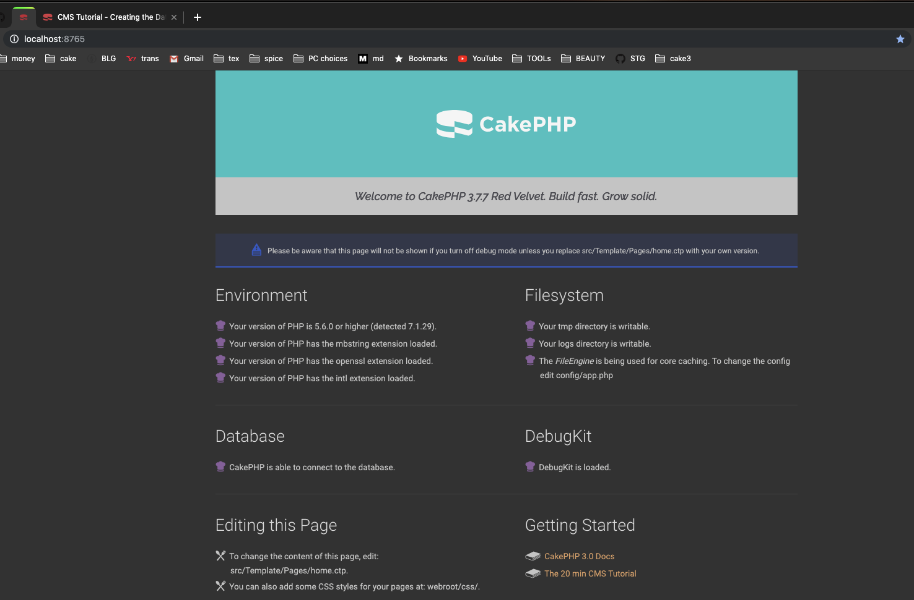

## Make MVC by hands
### controller
To make a page, you need to make a proper controller.  
To make `localhost://8765/intern` page,  
You have to make `InternController.php`  
In `src/Controller/`  
Inside this, write:
```
<?php
namespace App\Controller;

use App\Controller\AppController;

class InternController extends AppController {
    public function index() {

    }
}
```
This refers to the views index.php file.  
Now You can access by browser `8765/intern`  
### View
If you want to write contents here, 
make view file. In this case,
```
src/Template/Intern/index.ctp
```
is needed. So make it. Then write this inside  
`<h1><center>hello</center></h1>`  
If it worked, you will see:  
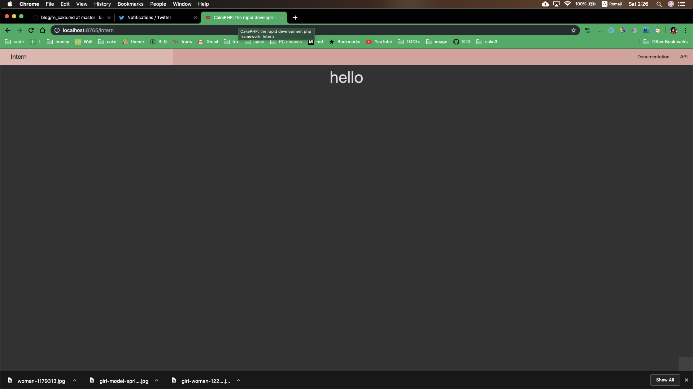
You could access to `/intern` and 
view the view file here.  

### Make Table
To access Database, we need to make Model file.  
First, Make the Database and Table inside.  
Create table by SQL, like:  
```
CREATE TABLE interns (
   id INT AUTO_INCREMENT PRIMARY KEY,
   email VARCHAR(255) NOT NULL,
);
```
This is simply id and email data.
#### Insert Table
Insert some records to the table:  
```
INSERT INTO interns (email) VALUES
('cakephp@example.com');
```
### Model
This is `MVC` frame work. we made:  
VIEW, CONTROLLER, M left.  
This is MODEL. So let's make it.  
Write the table connection in Model here:  
```
Model/Table/
```
Make InternsTable.php  
Careful! Everything are pural.  
Inside here:  
```
namespace App\Model\Table;

use Cake\ORM\Table;

class InternsTable extends Table {
}
```
and check this. In InternsController, write:  
```
debug($this->Interns);
```
You can see the database , the intern table.  

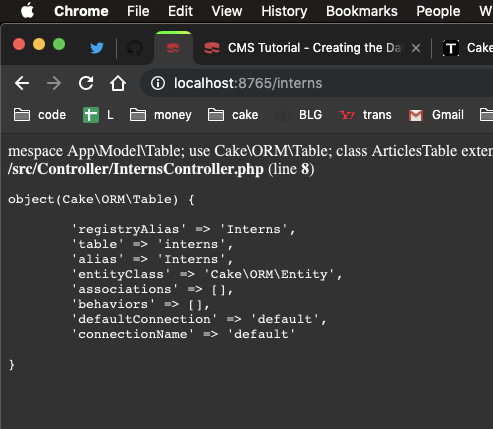
## Passing data
That was happening in Controller.  
To see in View, you need to pass the data.  
Write this in InternsController::index()
```
$this->loadComponent('Paginator');
$interns = $this->Paginator->paginate(
    $this->Interns->find()
    );

$this->set(compact('interns'));
debug($this->Interns);

```
Cushioning `paginator`,
`$this->loadComponent('Paginator');`  
`$this->Paginator->paginate()`  
Enables to confirm the DB simply.  

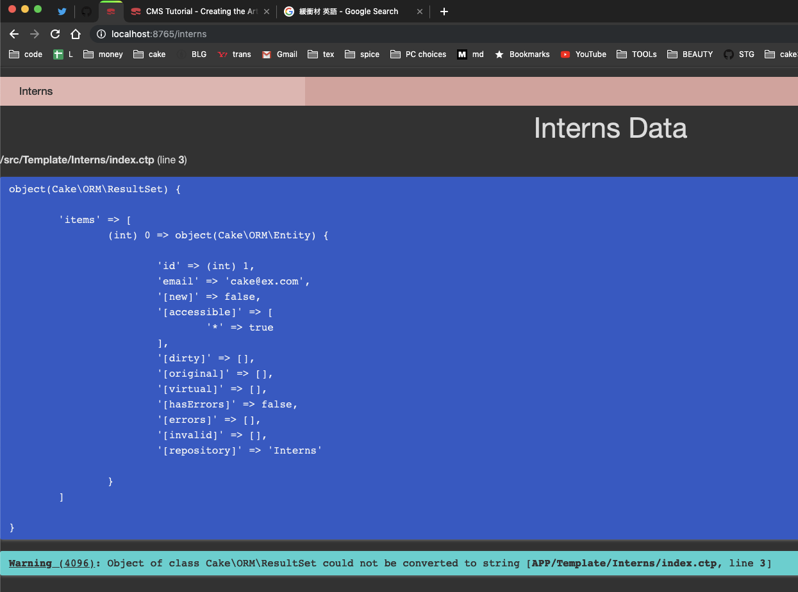

## Show the table by for each
In index.ctp,
```
<?php foreach($interns->toArray() as $obj): ?>
<h1> <?= $obj->id?></h1>
<h1> <?= $obj->name?></h1>
<h1> <?= $obj->email?></h1>
<h1> <?= $obj->location?></h1>
<?php endforeach; ?>
```
Then you can see all the email data of 
mail list 
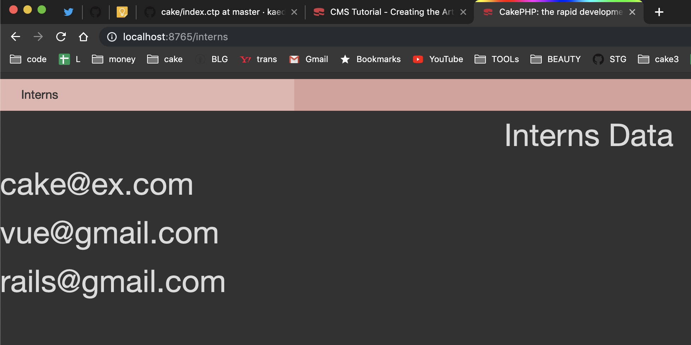

### Add more records by insert
Then add more records inside.  
Add column desc  
cake, vue, rails, jq, react, laravel,  
sato, suzuki, tanaka, Tom, Bob, Emma,  
Ykhm, Tko, Tokyo, Kyot, US, UK, USSR,  

Kubo, Seki, Mori,  
cobol,Java, Excel,  
Fuksm, Oita, Ueno,  

like this:  
```
insert into interns
(email,name,text,location)
values ('sh@gmail.com', 'Name', 'Desc', 'Tokyo')
```


## Bake
We made table inside the database, 
Controller, View, Model files.  
But these operations are available by `bake` command.  

### Refered
[CakePHP3のマイグレーションまとめ]
(https://qiita.com/ozawan/items/8144e02ca70519f3dcaf)

### migration 
`bin/cake migration...` `bin/cake migrations migarte`
can make a table, 
insert column, del column, and del tabel,
This command makes migration file in config/Migration/
#### make a table
```
bin/cake bake migration CreateTableName  
columnName:string columnName:text created modified  
```
Let's make a sample named `products`

Here the result:  
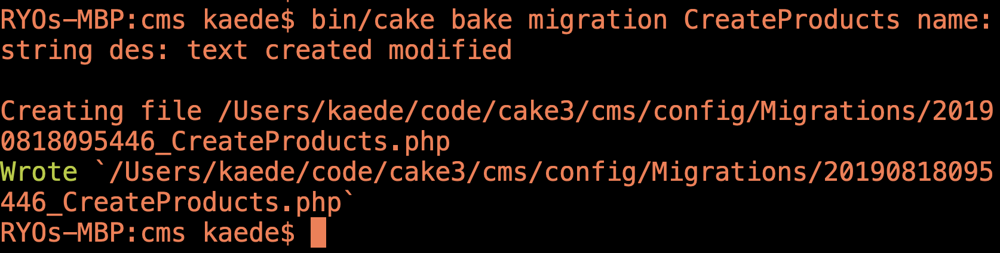

Then the created file in `config/Migrations/` here:  
```
<?php
use Migrations\AbstractMigration;

class CreateProducts extends AbstractMigration
{
    /**
     * Change Method.
     *
     * More information on this method is available here:
     * http://docs.phinx.org/en/latest/migrations.html#the-change-method
     * @return void
     */
    public function change()
    {
        $table = $this->table('products');
        $table->addColumn('name', 'string', [
                'default' => null,
                'limit' => 255,
                'null' => false,
        ]);
        $table->addColumn('des', 'string', [
                'default' => null,
                'limit' => 255,
                'null' => false,
        ]);
        $table->addColumn('text', 'string', [
                'default' => null,
                'limit' => 255,
                'null' => false,
        ]);
        $table->addColumn('created', 'datetime', [
                'default' => null,
                'null' => false,
        ]);
        $table->addColumn('modified', 'datetime', [
                'default' => null,
                'null' => false,
        ]);
        $table->create();
    }
}
```
That simple bake command made this file!!  

Then you run 
```
bin/cake migrations migrate
```
NO BAKE IN MIGRATE, migrationS are plural!!  
And all the files in `config/Migrations/` run.  
If No errs, the table will be created.  

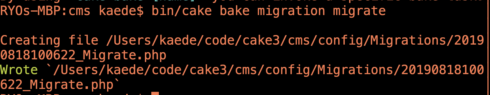
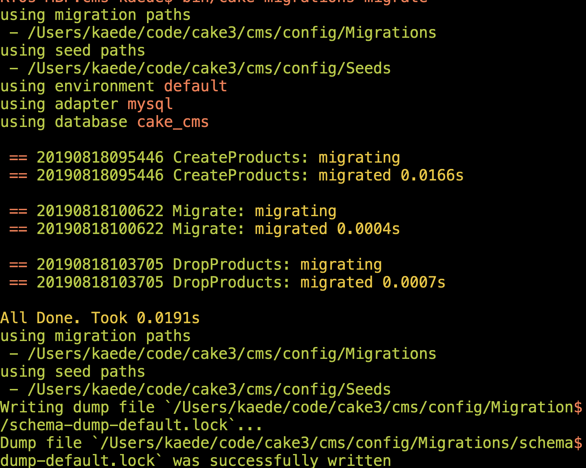

It also make a migrate file:  

```
<?php
use Migrations\AbstractMigration;

class Migrate extends AbstractMigration
{
    /**
     * Change Method.
     *
     * More information on this method is available here:
     * http://docs.phinx.org/en/latest/migrations.html#the-change-method
     * @return void
     */
    public function change()
    {
    }
}
```
See the table in MySQL:  

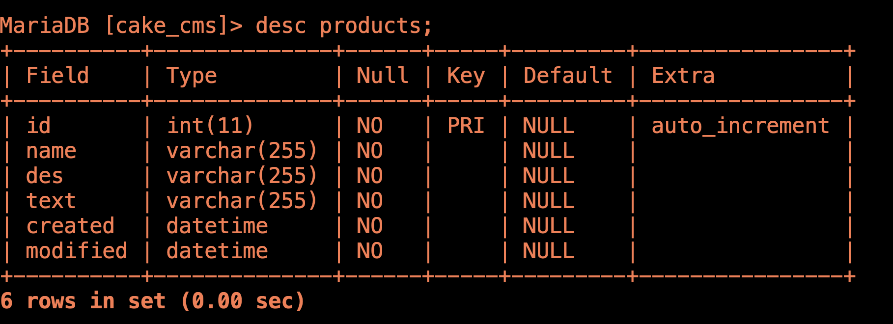

`id` auto++ column was made automatically.  
`string` and `text` are same varchar255 type.  

#### Del a table
bin/cake bake migration DropTableName  
#### Add a column
Try this.  
```
bin/cake bake migration AddPriceToTableName price:decimal
```
```
Creating file /Users/kaede/code/cake3/cms/config/Migrations/20190818110206_AddPriceToProducts.php
Wrote `/Users/kaede/code/cake3/cms/config/Migrations/20190818110206_AddPriceToProducts.php`
```
Inside the php file:  
```
public function change()
{
    $table = $this->table('products');
    $table->addColumn('price', 'decimal', [
            'default' => null,
            'null' => false,
    ]);
    $table->update();
}
```
Then, migrations.  
```
RYOs-MBP:cms kaede$ bin/cake migrations migrate
using migration paths
- /Users/kaede/code/cake3/cms/config/Migrations
using seed paths
- /Users/kaede/code/cake3/cms/config/Seeds
using environment default
using adapter mysql
using database cake_cms

== 20190818110206 AddPriceToProducts: migrating
== 20190818110206 AddPriceToProducts: migrated 0.0099s

All Done. Took 0.0112s
using migration paths
- /Users/kaede/code/cake3/cms/config/Migrations
using seed paths
- /Users/kaede/code/cake3/cms/config/Seeds
Writing dump file `/Users/kaede/code/cake3/cms/config/Migrations/schema-dump-default.lock`...
Dump file `/Users/kaede/code/cake3/cms/config/Migrations/schema-dump-default.lock` was successfully written
```
Desc in MySQL:  
```
MariaDB [cake_cms]> desc products;
+----------+---------------+------+-----+---------+----------------+
| Field    | Type          | Null | Key | Default | Extra          |
+----------+---------------+------+-----+---------+----------------+
| id       | int(11)       | NO   | PRI | NULL    | auto_increment |
| name     | varchar(255)  | NO   |     | NULL    |                |
| des      | varchar(255)  | NO   |     | NULL    |                |
| text     | varchar(255)  | NO   |     | NULL    |                |
| created  | datetime      | NO   |     | NULL    |                |
| modified | datetime      | NO   |     | NULL    |                |
| price    | decimal(10,0) | NO   |     | NULL    |                |
+----------+---------------+------+-----+---------+----------------+
```
you can see the new column `price` appeared.

#### roll back
`bin/cake migrations rollback` can reset.
```
RYOs-MBP:cms kaede$ bin/cake migrations rollback
using migration paths
- /Users/kaede/code/cake3/cms/config/Migrations
using seed paths
- /Users/kaede/code/cake3/cms/config/Seeds
using environment default
using adapter mysql
using database cake_cms
ordering by creation time

== 20190818110206 AddPriceToProducts: reverting
== 20190818110206 AddPriceToProducts: reverted 0.0099s

All Done. Took 0.0115s
using migration paths
- /Users/kaede/code/cake3/cms/config/Migrations
using seed paths
- /Users/kaede/code/cake3/cms/config/Seeds
Writing dump file `/Users/kaede/code/cake3/cms/config/Migrations/schema-dump-default.lock`...
Dump file `/Users/kaede/code/cake3/cms/config/Migrations/schema-dump-default.lock` was successfully written
```
Then `migrate`, everything reverted.
```
| created  | datetime      | NO   |     | NULL    |                |
| modified | datetime      | NO   |     | NULL    |                |
| price    | decimal(10,0) | NO   |     | NULL    |                |
+----------+---------------+------+-----+---------+----------------+
7 rows in set (0.00 sec)

MariaDB [cake_cms]> desc products;
+----------+--------------+------+-----+---------+----------------+
| Field    | Type         | Null | Key | Default | Extra          |
+----------+--------------+------+-----+---------+----------------+
| id       | int(11)      | NO   | PRI | NULL    | auto_increment |
| name     | varchar(255) | NO   |     | NULL    |                |
| des      | varchar(255) | NO   |     | NULL    |                |
| text     | varchar(255) | NO   |     | NULL    |                |
| created  | datetime     | NO   |     | NULL    |                |
| modified | datetime     | NO   |     | NULL    |                |
+----------+--------------+------+-----+---------+----------------+
6 rows in set (0.00 sec)

MariaDB [cake_cms]> desc products;
+----------+---------------+------+-----+---------+----------------+
| Field    | Type          | Null | Key | Default | Extra          |
+----------+---------------+------+-----+---------+----------------+
| id       | int(11)       | NO   | PRI | NULL    | auto_increment |
| name     | varchar(255)  | NO   |     | NULL    |                |
| des      | varchar(255)  | NO   |     | NULL    |                |
| text     | varchar(255)  | NO   |     | NULL    |                |
| created  | datetime      | NO   |     | NULL    |                |
| modified | datetime      | NO   |     | NULL    |                |
| price    | decimal(10,0) | NO   |     | NULL    |                |
+----------+---------------+------+-----+---------+----------------+
7 rows in set (0.01 sec)
```

#### Delete a column
bin/cake bake migration RemovePriceFromTableName price
```
RYOs-MBP:cms kaede$ bin/cake bake migration RemoveTextFromProducts text

Creating file /Users/kaede/code/cake3/cms/config/Migrations/20190818112124_RemoveTextFromProducts.php
Wrote `/Users/kaede/code/cake3/cms/config/Migrations/20190818112124_RemoveTextFromProducts.php`
```
```
public function change()
{
    $table = $this->table('products');
    $table->removeColumn('text');
    $table->update();
}
```
`bin/cake migrations migrate`
```
MariaDB [cake_cms]> desc products;
+----------+---------------+------+-----+---------+----------------+
| Field    | Type          | Null | Key | Default | Extra          |
+----------+---------------+------+-----+---------+----------------+
| id       | int(11)       | NO   | PRI | NULL    | auto_increment |
| name     | varchar(255)  | NO   |     | NULL    |                |
| des      | varchar(255)  | NO   |     | NULL    |                |
| created  | datetime      | NO   |     | NULL    |                |
| modified | datetime      | NO   |     | NULL    |                |
| price    | decimal(10,0) | NO   |     | NULL    |                |
+----------+---------------+------+-----+---------+----------------+
6 rows in set (0.00 sec)
```
column text was deleted!!!!

#### change column
have to write inside on our own?

[CakePHP3のMigration（マイグレーション）でカラム追加・変更・削除を行う]
(https://www.ritolab.com/entry/61)

### bake all 
`bin/cake bake all tableNames` cmd can make proper 
[controller, model, ctps(index,add,edit,view),]  
```
RYOs-MBP:cms kaede$ bin/cake bake all products
Bake All
---------------------------------------------------------------
One moment while associations are detected.

Baking table class for Products...

Creating file /Users/kaede/code/cake3/cms/src/Model/Table/ProductsTable.php
Wrote `/Users/kaede/code/cake3/cms/src/Model/Table/ProductsTable.php`

Baking entity class for Product...

Creating file /Users/kaede/code/cake3/cms/src/Model/Entity/Product.php
Wrote `/Users/kaede/code/cake3/cms/src/Model/Entity/Product.php`

Baking test fixture for Products...

Creating file /Users/kaede/code/cake3/cms/tests/Fixture/ProductsFixture.php
Wrote `/Users/kaede/code/cake3/cms/tests/Fixture/ProductsFixture.php`
Bake is detecting possible fixtures...

Baking test case for App\Model\Table\ProductsTable ...

Baking controller class for Products...

Creating file /Users/kaede/code/cake3/cms/src/Controller/ProductsController.php
Wrote `/Users/kaede/code/cake3/cms/src/Controller/ProductsController.php`
Bake is detecting possible fixtures...

Baking test case for App\Controller\ProductsController ...

Creating file /Users/kaede/code/cake3/cms/tests/TestCase/Controller/ProductsControllerTest.php
Wrote `/Users/kaede/code/cake3/cms/tests/TestCase/Controller/ProductsControllerTest.php`

Baking `index` view template file...

Creating file /Users/kaede/code/cake3/cms/src/Template/Products/index.ctp
Wrote `/Users/kaede/code/cake3/cms/src/Template/Products/index.ctp`

Baking `view` view template file...

Creating file /Users/kaede/code/cake3/cms/src/Template/Products/view.ctp
Wrote `/Users/kaede/code/cake3/cms/src/Template/Products/view.ctp`

Baking `add` view template file...

Creating file /Users/kaede/code/cake3/cms/src/Template/Products/add.ctp
Wrote `/Users/kaede/code/cake3/cms/src/Template/Products/add.ctp`

Baking `edit` view template file...

Creating file /Users/kaede/code/cake3/cms/src/Template/Products/edit.ctp
Wrote `/Users/kaede/code/cake3/cms/src/Template/Products/edit.ctp`
Bake All complete.
```
This command make a crud basis. (without D)  
Access to localhost8765/products/  

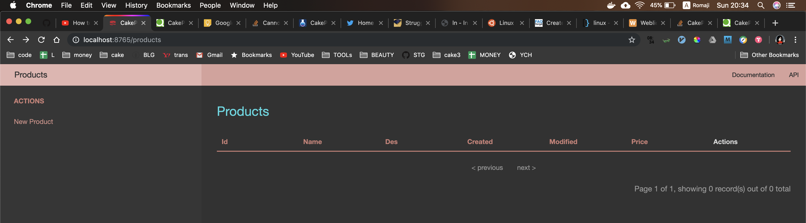
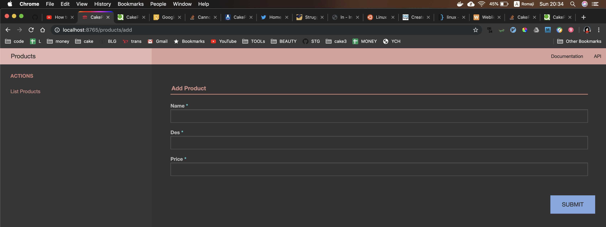


## Link to the Men clicked
That index.ctp was a list of all intern students,  
so make a link to `detail.ctp` page,  
and make the page.  

## link CSS
Write this in index.ctp
```
$this->Html->css('interns');
```


## todo
LOGIN

Then make top page, and inserting calc, 
and deleting calc by db

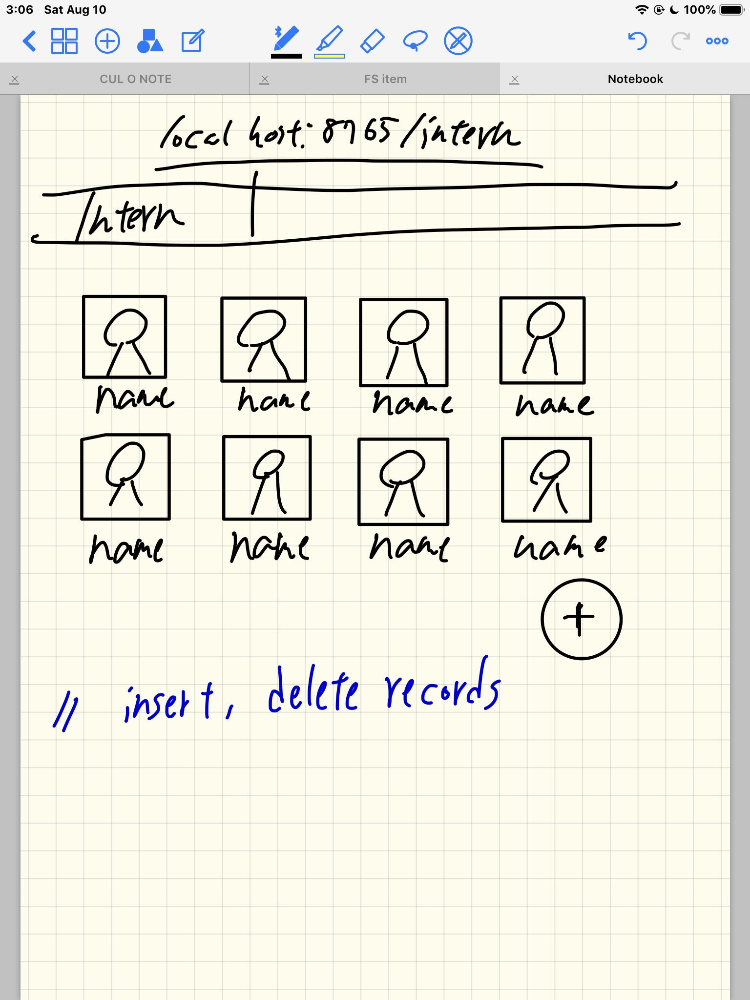

