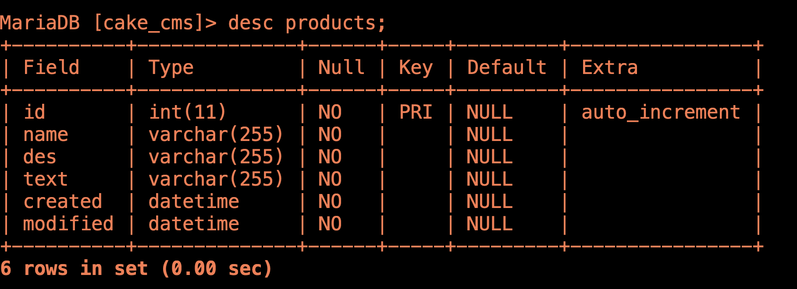

# cake3 usage
## public tutorial
https://book.cakephp.org/3.0/en/tutorials-and-examples/cms/articles-controller.html
## install
```sh
curl -s https://getcomposer.org/installer | php

Composer (version 1.9.0) successfully installed to: /Users/kaede/code/cake3/composer.phar
php composer.phar create-project --prefer-dist cakephp/app hoge
- Installing cakephp/plugin-installer (1.1.1): Downloading (100%)
```
When completed, Directory will be like this:
```sh
▾ interns/
    ▸ bin/
    ▸ config/
    ▸ logs/
    ▸ plugins/
    ▸ src/
    ▸ tests/
    ▸ tmp/
    ▸ vendor/
    ▸ webroot/
        composer.json
        composer.lock
        index.php
        phpunit.xml.dist
        README.md
composer.phar
README.md
```
## start server
```
bin/cake server
```
runs app in http://localhost:8765/  
Defalt Page is this:


At first, your cakephp project is not connected to Database.   

(img)

Writing setting file and making a database enables connection.  

## connect Database(DB)
Rewrite `app.php` 
```php
In Datasources:
'className' => 'Cake\Database\Connection',
'driver' => 'Cake\Database\Driver\Mysql',
'username' => 'root',
'password' => '',
'database' => 'yourDBname',
```
## create DB
Download XAMPP or LAMPP and create your DB.  
https://www.mysql.com/downloads/  
https://www.apachefriends.org/download.html

open XAMPP and start all.  
```MySQL
mysql -u root
create database hoge;
```
You see SQL is connected now.  

(img)

## create table
CakePHP can make tables by simple commands  
https://qiita.com/ozawan/items/8144e02ca70519f3dcaf

```cakephp
bin/cake bake migration CreateTableName  
columnName:string columnName:text created modified  
```


This makes `20190924_migration.php`, but this did not made 
the table yet.

You have to execute this by:
```
bin/cake migrations migrate
```


